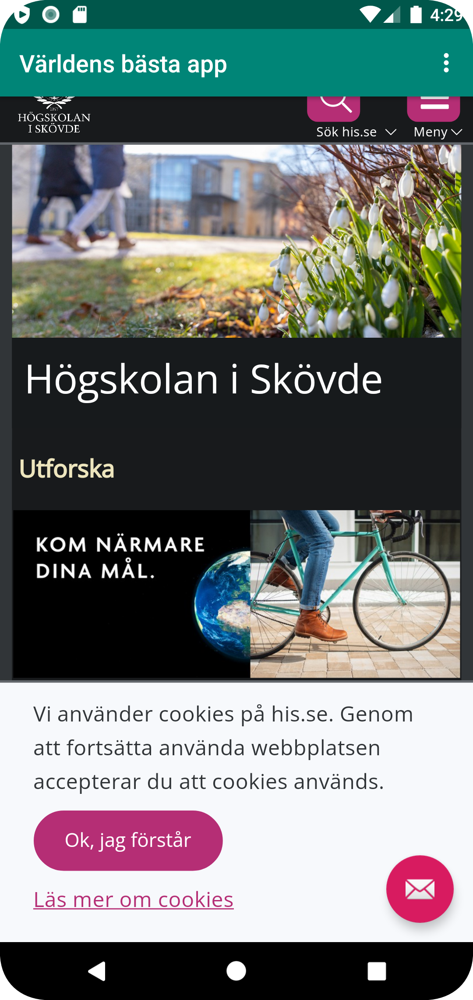
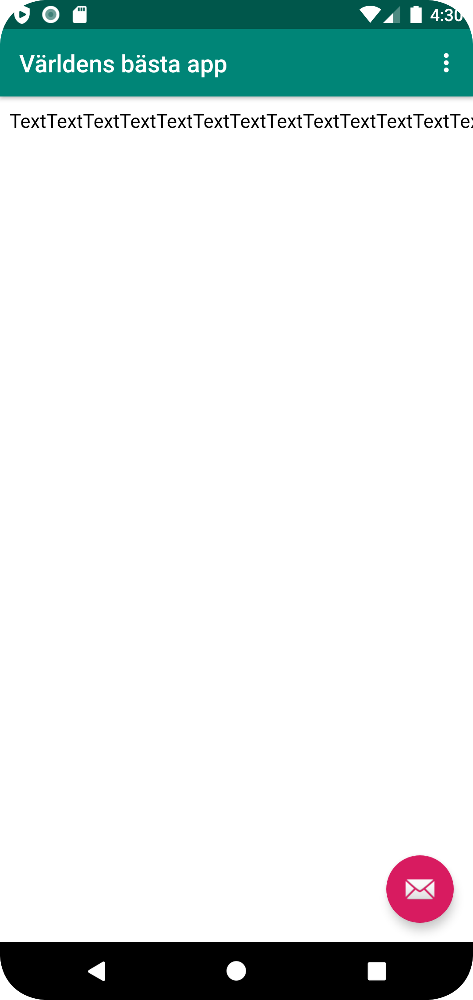

# Rapport

**En app har skapats som heter "Världens bästa app". Appen har fått tillgång till internet i "AndroidManifest.xml". En webview med id:"my_webview" skapades i "content_main.xml". Sedan skapades en variabel i Java som blev kopplad med den view som har id:"my_webview". Javascript aktiverades för att tillåta JavaScript och WebViewClient lades in för att undvika användningen av Chrome vid användningen av extern webbsida (se kodsnutt 1).**
```
myWebView.getSettings().setJavaScriptEnabled(true);//Javascript is not enabled by default
myWebView.setWebViewClient(new WebViewClient());// We want to open this in the app.
```
**Därefter skapades en (intern) sida i HTML som heter "page1.html". Sidan lades in i mappen assets som jag också skapade. Efter det laddades den externa och den interna sidan in i Java-koden (se kodsnutt 2).**
```
public void showExternalWebPage(){
        myWebView.loadUrl("https://www.his.se/");
    }

    public void showInternalWebPage(){
        myWebView.loadUrl("file:///android_asset/page1.html");
    }
```
**Slutligen lades kod in som kallar på dessa olika funktioner när användaren använder dropdown-menyn.
Här är ett skärmklipp på den externa sidan i min emulator:**

**Här är ett skärmklipp på den interna sidan i min emulator:**
